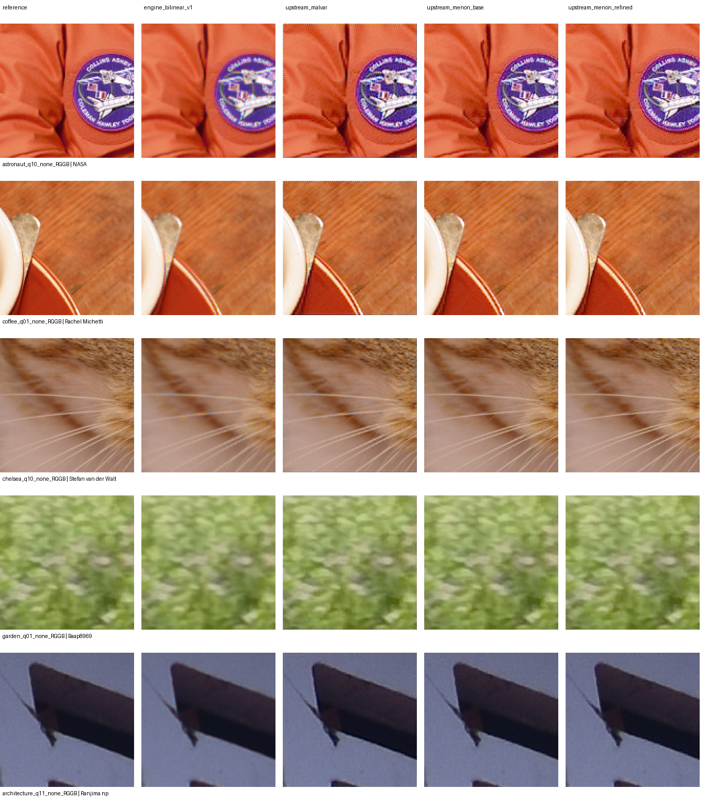

# Menon photographic study and C++ prototype — 2026-10-01

**Positive conclusion:** the original Menon base method improves every source image in this bounded photographic study, and a standalone C++ implementation reproduces the pinned upstream base output bit for bit. Continue with this established base method. The evidence supports a practical implementation path; it does not admit a product backend or establish actual-camera quality.

This follows the [Colour Science code review](COLOUR_DEMOSAIC_CODE_REVIEW.md). The [implementation plan](../plan/LIBRAWOPS_PLAN.md) remains the authoritative handoff. The previous original/guarded scalar rejections, immutable native bilinear and replacement policy v1 remain intact. No new speculative algorithm variant was invented.

## Photographic scope fixed before scoring

Five rendered RGB photographs cover a face and fabric, fur, wood/coffee, foliage and architecture. Four native 128×128 quadrant crops per photograph, all four effective Bayer patterns and two prefilter conditions yield **160 cases**. The manifest and protocol record exact asset hashes, source/rights URLs, crop selection, sRGB interpretation, quantization, metrics and the exploratory continuation screen:

- [Asset manifest](../../tests/reference/raw/photo_remosaic_assets_v1.json), SHA-256 `caf67bad2e7bcd589fd2f0282256d1a1c177b81a07def42f72ed5ad95bf16990`.
- [Protocol](../../tests/reference/raw/photo_remosaic_protocol_v1.json), SHA-256 `179493d18051b3843fbab23e80e3f3bebbe904540b8a7628dad34024dcf2620b`.

NASA's astronaut portrait is identified as public domain by [scikit-image](https://scikit-image.org/docs/stable/api/skimage.data.html#skimage.data.astronaut), with [NASA media guidance](https://www.nasa.gov/nasa-brand-center/images-and-media/) also reviewed. Scikit-image identifies Rachel Michetti's [coffee](https://scikit-image.org/docs/stable/api/skimage.data.html#skimage.data.coffee) and Stefan van der Walt's [cat](https://scikit-image.org/docs/stable/api/skimage.data.html#skimage.data.chelsea) photographs as CC0. The Commons [garden](https://commons.wikimedia.org/w/index.php?title=File:Colorful_Flower_Garden_with_Visitors_Enjoying_Nature.jpg&oldid=1256961092) and [architecture](https://commons.wikimedia.org/w/index.php?title=File:A_architecture.jpg&oldid=1140537344) pages record uploader own-work/CC0 declarations. The manifest retains authors and cached rights-evidence hashes. Originals stay in ignored local research storage; the comparison board contains attributed crop derivatives.

Rocket was excluded: its primary Flickr page pointed to CC BY-NC despite a secondary public-domain description. A separate temple download failed before selection. Neither appears in the frozen five-image study.

The first setup guard rejected the astronaut/cat embedded ICC profile **before any scores were produced**. Protocol setup revision 2 permits that exact IEC 61966-2.1 sRGB profile hash. No crop, algorithm, metric or continuation threshold changed. Untagged photos are explicitly assumed sRGB. The superseded setup hash is recorded in the current protocol.

Decode sRGB to linear values, optionally apply spatial Gaussian sigma 0.6, then Bayer-sample and quantize to uint16 with black 4000/white 19000. Normalize observations to float32 before reconstruction. Compare native-v1-equivalent bilinear, pinned upstream Malvar, Menon base/refined and separate Menon adapters with the old six/eight-pixel bilinear band. Aggregate equal case weights within each image, then equal image weights. Report whole image, common radius-eight interior and border band separately.

Each crop is a separate simulated active image; its edges are experimental image boundaries, not internal tiles of the full photograph. These photos have prior processing, possible prior demosaicing and JPEG artifacts. Their RGB values provide a **remosaicing reference**, not sensor ground truth. The blur condition is a sensitivity control, not a calibrated optical or noise model. The actual-camera corpus still has zero admitted captures.

## Results and candidate selection

Interior linear-RGB RMSE reduction versus bilinear:

| Pinned method | Unblurred | Gaussian sigma 0.6 | Images improving in each condition |
|---|---:|---:|---:|
| Menon base | **35.82%** | **32.09%** | **5/5** |
| Menon refined | 35.15% | 27.17% | 5/5 |
| Malvar | 26.67% | 28.62% | 5/5 |

Menon base's per-image interior RMSE reductions:

| Image | Unblurred | Gaussian sigma 0.6 |
|---|---:|---:|
| Astronaut | 50.18% | 52.61% |
| Cat | 40.30% | 31.30% |
| Coffee | 20.80% | 11.03% |
| Garden | 19.23% | 20.74% |
| Architecture | 32.02% | 29.20% |

Every upstream candidate passed the separately frozen exploratory screen in both conditions: at least 10% mean interior gain, four improving images, no image-mean regression over 5%, exact observations and finite output. That screen authorizes only further research. **Base is the primary candidate** because it gives the most consistent aggregate benefit across these two conditions; refinement remains available in the prototype for comparison. This is not a universal ranking across cameras or scenes.

Original Menon borders also improve the complete crops. Unblurred whole-image mean RMSE drops from **0.01800354 bilinear to 0.01177690 base**; the old final bilinear-band adapter gives 0.01321295. With blur, the corresponding values are 0.00961490, 0.00667524 and 0.00730474. The wide fallback discards measurable benefit. Malvar's interior gain does not extend to its complete-crop scores here: its original border treatment raises whole-image RMSE above bilinear in both conditions.



The board uses the hardest unblurred RGGB crop per photograph **according to bilinear interior RMSE**, not the candidate's gain. It displays sRGB-encoded/clipped previews at 2× nearest-neighbor scale; quantitative scores use unbounded linear reconstruction. The face/badge and whisker crops show reduced color fringes; residual texture/alias artifacts remain visible. This board is a diagnostic, not a blinded perceptual study.

## Standalone C++ implementation and validation

[research/menon](../../research/menon/README.md) is an independent CMake project. It is not connected to the engine build, public API, install rules or saved reconstruction identities. It implements the exact pinned base stages and optional three-stage refinement using double intermediates and float32 output, horizontal ties, original mirror/zero boundary rules, exact observed copies and no clipping or sign guard. The BSD-3-Clause [upstream notice](../../research/menon/LICENSE.colour-demosaicing) is retained byte for byte. Only the C++ standard library is linked; the scientific runtime is an optional external oracle.

The contract was written before the implementation: finite normalized float32 active planes, caller-rebased CFA, at most one million samples, whole-plane reconstruction before ROI extraction. Singleton axes explicitly use valid-neighbor native-v1 bilinear, because upstream squeezes those axes away and raises IndexError. ROI equivalence here proves cropping of a complete reconstruction; it does not prove bounded tile execution or composed halos.

MSVC **19.44.35228.0**, x64 Release, `/W4 /fp:strict`, builds without warnings. [The validation tool](../../tools/raw_menon_cpp_check.py) completed:

| Comparison group | Base/refined comparisons | Result |
|---|---:|---|
| All 160 saved photo planes, including borders | 320 | Pass |
| Earlier 164 synthetic audit cases, including rejected probes | 328 | Pass |
| Signed/headroom, four patterns/phases, two active origins, site-specific normalization | 64 | Bit exact |
| Small borders, constant and signed fields | 80 | Bit exact |
| Explicit singleton-axis fallback | 48 | Bit exact to independent bilinear |
| One-megapixel repeated photo plane | 2 | Pass |
| **Total** | **842** | **All pass** |

Across **421 base comparisons / 12,533,700 channels**, C++ is bit-identical to upstream (or the explicit thin fallback). Refined output is bit-identical in 12,530,161 of the same number of channels; maximum absolute difference is **5.960464477539063e-8**. Every reconstructed channel is within the predeclared two-float32-ULP plus float64-operation slack; all observed samples are bit exact. This is fidelity to upstream, including its known synthetic tradeoffs, not resolution of the earlier quality failures.

All **16 edge/interior ROI checks** match the complete C++ output byte for byte. All **14 malformed-input checks** reject before producing output: short/long files, invalid dimensions/pattern/mode, sample budget, integer overflow, invalid ROIs and NaN/infinities. Repeated one-megapixel outputs are bit exact. Other compilers/platforms are not yet verified.

One-megapixel reconstruction-only medians of three runs were **54.918 ms base / 73.213 ms refined** on the recorded work machine (Core i5-14500). These are unoptimized serial whole-plane research timings. File I/O, graph operations, WB/calibration, production frame sizes and bounded tile memory are excluded; the Balanced power scheme was confirmed after the run and background load was uncontrolled. Display resolution was unavailable through the permitted system query; no display rendering is timed. Hardware identity follows the prior work-machine record. Do not extrapolate them to the project's 45 MP/preview goals.

## Preserved evidence and reproduction

[Photo report/index](../../tests/reference/raw/photo_remosaic_v1.index.json) binds all 160 case metrics, output hashes, source/runtime/protocol and visualization selection. JSON SHA-256: `fb0ece9bf3e9bd21bd5d7fc0220992bf6e5d581147538ebab7cc65e6db1e2b05`; gzip: `55c9fa65a3ede5998004fbb925952d00de574e0784c303f1185f2c30715b3c05`.

[C++ parity report/index](../../tests/reference/raw/menon_cpp_parity_v1.index.json) binds every comparison, observed/ROI/malformed check, timing, executable and prototype-file hashes. JSON SHA-256: `ac732702a4ffdd8b3a84bb7fd38eb2bec3033bf8b9f527fac374f118f59dba38`; gzip: `8dfed911f2dd888939d0ac6815db3d2d2ddfa74d7fc29d6171ad261d9b8cd8cc`.

An independent final check regenerated all **160 truth/quantized Bayer planes** from the hashed assets, verified the raw reference arrays and recomputed **320 base/refined whole/interior RMSE measurements** plus whole-image maxima. Archive/tool/prototype/protocol/assets/rights/contact-sheet bindings and protected prior evidence hashes pass. Python syntax, whitespace and the plan's 98/142 checklist counts also pass.

Archives use gzip `mtime=0`; different evidence is never overwritten. Original photos, upstream source snapshots, the optional runtime and full binary oracle planes remain ignored research cache. A fresh machine must recover those exact hashed inputs before reproduction. With the source/runtime/assets populated at the recorded paths:

```sh
python tools/raw_photo_remosaic.py build/research/colour-code-review-v1 build/research/menon/upstream-runtime build/research/photo-demosaic-v1 build/research/photo-demosaic-v1/references docs/research/photo_remosaic_comparison_v1.png build/research/photo-demosaic-v1/report-v1.json
cmake -S research/menon -B build/research/menon-cpp -G "Visual Studio 17 2022" -A x64
cmake --build build/research/menon-cpp --config Release
python tools/raw_menon_cpp_check.py build/research/menon-cpp/Release/menon_research.exe build/research/colour-code-review-v1 build/research/menon/upstream-runtime build/research/photo-demosaic-v1/references build/research/photo-demosaic-v1/report-v1.json build/research/menon-cpp/check build/research/menon-cpp/check-new.json
```

Use a fresh parity report path when repeating timings. This run used bundled Python 3.12.14/Pillow 12.3.0 and isolated NumPy 2.3.5/SciPy 1.16.3/Colour 0.4.6 helpers. Upstream code is pinned to `7bff324983fb77b41444fda3bf922e354d386d1c`, not the currently installed algorithm files.

## Quality-contract review and next checkpoint

Policy v1 rejects the previous variants for universal synthetic improvement/regression and the single-site analytical allowance. The pinned established implementation has the same central counterexamples, while these photographic remosaicing results show useful aggregate gains. Both findings stand. A universal replacement claim is unsupported; a separately versioned optional base candidate is now worth developing. No gate or old result was changed to achieve this conclusion.

Next, freeze and implement **bounded staged tiles** in this isolated prototype: preserve true-image borders, prove the composed dependencies, adapt the existing uint16/site-level/phase/active-area contract and check hostile padding plus full/tile/ROI equivalence against these whole-plane outputs. Acquire reviewed actual-camera captures as a separate evidence task; record decoder/settings/rights and inspect calibrated crops before product admission. Any practical candidate-quality contract must state its intended use and preserve signed/observed/metadata/tile guarantees while recording alias/impulse/chromatic limitations. Keep policy v1 and its rejections immutable. Candidate patent/jurisdiction/shipment review remains separate and open; BSD copyright permission does not close it.

No native engine backend, camera-corpus admission, root-build change, dependency admission, commit or push occurred in this step. Earlier full product suites (20/20 default, 11/11 core-only, 12/12 LittleCMS) were not repeated; this step's verification is the standalone build and checks above.
