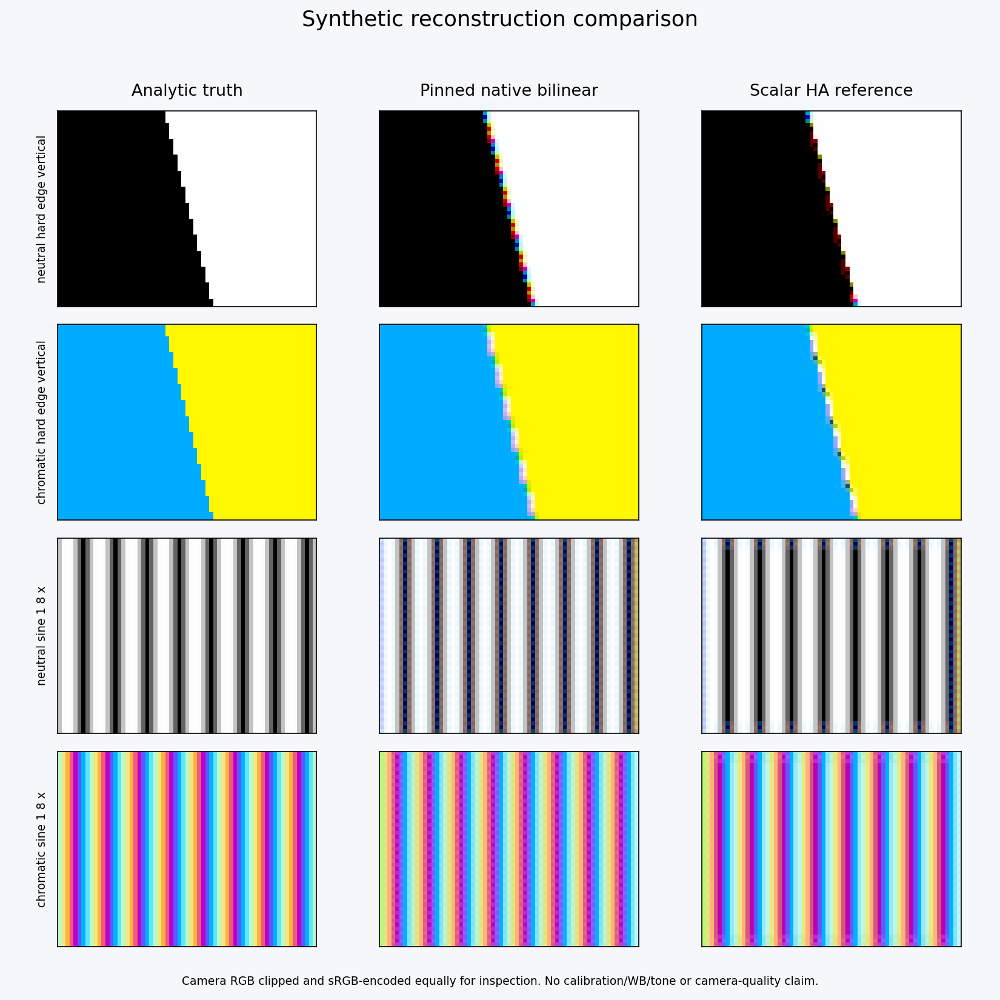
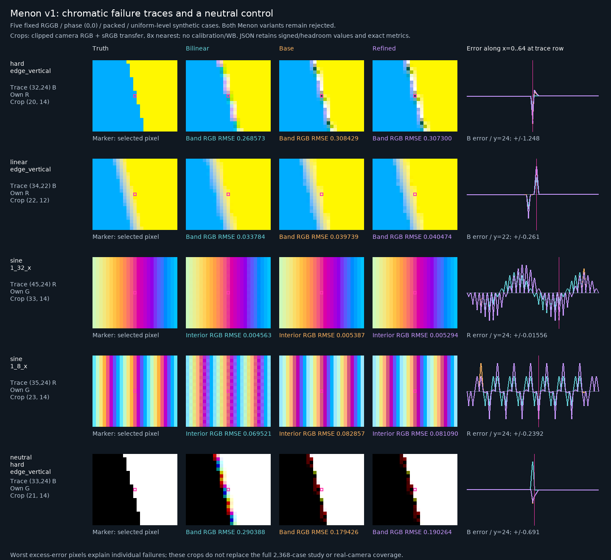

# RAW demosaic candidates and camera corpus — initial review

Initially reviewed 2026-09-30 against local code base `de66627`; continued 2026-10-01 at pulled `e2eb724`. The original Hamilton–Adams and Menon scalar variants remain rejected against frozen policy v1. The [photographic/C++ continuation](MENON_PHOTOGRAPHIC_CPP_STUDY.md) now provides positive evidence for the established Menon base method and a verified standalone BSD-noticed C++ research implementation. The user-authorized [native Menon base v1](MENON_ENGINE_V1.md) is now usable as an opt-in prototype backend, with bounded sensor/tile integration and exact upstream parity. No scientific runtime dependency or actual-camera asset is admitted; production and shipment qualification remain open. The authoritative handoff remains [the implementation plan](../plan/LIBRAWOPS_PLAN.md).

## Candidate comparison

| Candidate | Published design | Fit with this engine — engineering inference | Admission status |
|---|---|---|---|
| Malvar–He–Cutler (MHC, 2004) | Local 5×5 linear filters with cross-channel correction | Compact implementation; a fixed radius-two stencil would be straightforward to plan, subject to explicit CFA and border rules | Hold: known patent requires current status/family review; reviewed IPOL code is unsuitable for redistribution |
| Hamilton–Adams (1997) | Direction classification from gradients/second derivatives, then directional color interpolation | Original scalar v1 now measured, with radius-three support and explicit bilinear border | Scalar version rejected by frozen analytical/regression/improvement gates; no native admission; jurisdiction review remains open |
| Menon–Andriani–Calvagno DDFAPD (2007) | Directional interpolation, a posteriori decision and refinement | Original scalar base/refined remain characterized; faithful double-intermediate standalone C++ port now passes 842 comparisons | Original policy-v1 variants rejected; photographic base gains 35.82%/32.09%; user-authorized opt-in native base v1 implemented, camera/production/release qualification open |
| Original guarded Menon base experiment | Same published base stages with an original missing-color curvature-sign guard | Separate scalar identity; proved radius 6; all 2,368 cases measured | Rejected: chromatic detail improves, neutral hard-edge quality declines, 14/24 improvement gates; bounded trial closed |

Primary design references: [Microsoft MHC paper](https://www.microsoft.com/en-us/research/wp-content/uploads/2016/02/Demosaicing_ICASSP04.pdf), [Hamilton–Adams US grant](https://patentimages.storage.googleapis.com/79/b2/75/80e2af2ff91dc9/US5629734.pdf), and [Menon publication record and DOI](https://www.research.unipd.it/handle/11577/2452626). The Microsoft paper also explains why simple RGB subsampling does not fully model real sensor acquisition. None of these publications establishes that an implementation will meet our frozen replacement policy.

**Updated recommendation — 2026-10-01:** validate the implemented [opt-in native Menon base v1](MENON_ENGINE_V1.md) on reviewed actual-camera data and record its practical quality disposition. The code review found no missing scalar stage; photographic evidence favored original base/borders. Bounded sensor/tile/ROI integration now matches all 93 synthetic and 160 photo references exactly (photo MSE 0), with source-policy/cache/history/jobs/calibrated previews verified. Original universal-policy rejection remains unchanged. End-to-end/target performance and camera/release audits remain open; do not resume speculative guard tuning or switch the default from bilinear.

## Provenance and patent findings

The [original MHC grant, US7502505B2](https://patentimages.storage.googleapis.com/86/f9/48/5d5f71204128d2/US7502505.pdf), records a March 15, 2004 filing, March 10, 2009 grant and **1,046 days of patent-term adjustment**. Publication age therefore cannot establish expiry. Current official status, relevant claims, related grants and target jurisdictions remain unreviewed. Search indexes are discovery aids rather than clearance evidence.

The [reviewed IPOL MHC source terms](https://www.ipol.im/pub/art/2011/g_mhcd/srcdoc/dmmalvar_8c.html) restrict use and redistribution, and identify additional patent restrictions. Do not copy, compile, port or ship that reference implementation. The original paper may inform an independently written design, but that does not resolve patent admission.

The [original Hamilton–Adams grant, US5629734A](https://patentimages.storage.googleapis.com/79/b2/75/80e2af2ff91dc9/US5629734.pdf), records a March 17, 1995 filing and May 13, 1997 grant, and identifies the related US5506619 work. Confirm current official status and relevant family/jurisdiction coverage before admission. An [IPOL author discussion from 2011](https://tools.ipol.im/mailman/archive/discuss/2011-April/000334.html) describes restricted historical reference-code terms; current per-file terms were not obtained in this review. No historical IPOL Hamilton–Adams code is an approved implementation source.

Menon's institutional record identifies DOI `10.1109/TIP.2006.884928`. The full article was unavailable at the initial September 30 review; the [October 1 continuation](#menon-ddfapd-research-contract-v1--2026-10-01) obtained and visually checked the public archived primary PDF. The upstream [Colour Science Menon source documentation](https://colour-demosaicing.readthedocs.io/en/develop/_modules/colour_demosaicing/bayer/demosaicing/menon2007.html) shows staged horizontal/vertical estimates, direction decisions, red/blue reconstruction and optional refinement with differing boundary treatments. That implementation was read as a reference; no code was imported. These searches do not establish the absence of applicable patents.

### Exact permissive reference-code snapshot

The upstream [Colour Science repository](https://github.com/colour-science/colour-demosaicing) was initially inspected at commit `7bff324983fb77b41444fda3bf922e354d386d1c`, dated 2026-06-27. At that initial review, exact upstream bytes were hashed without retaining or installing them; the October 1 continuation retrieved Menon/LICENSE again into ignored local research storage:

| File at that commit | SHA-256 |
|---|---|
| [LICENSE](https://github.com/colour-science/colour-demosaicing/blob/7bff324983fb77b41444fda3bf922e354d386d1c/LICENSE) | `62f431963cc2e7387c118c0798bcb323a1e0c0129b28265099ab74bf2a0c04af` |
| [malvar2004.py](https://github.com/colour-science/colour-demosaicing/blob/7bff324983fb77b41444fda3bf922e354d386d1c/colour_demosaicing/bayer/demosaicing/malvar2004.py) | `4e1b2e70841864bc91c3b1eab129d4303eb89ee7eb71140954f56e80dc01c020` |
| [menon2007.py](https://github.com/colour-science/colour-demosaicing/blob/7bff324983fb77b41444fda3bf922e354d386d1c/colour_demosaicing/bayer/demosaicing/menon2007.py) | `5621bde89d89f85962ac19afc47ad0dc63d962d7f11a3895d9a60d3aa0f8fbf2` |
| [pyproject.toml](https://github.com/colour-science/colour-demosaicing/blob/7bff324983fb77b41444fda3bf922e354d386d1c/pyproject.toml) | `73f4254287daa552278f4c8e161ef5005e6b1fd431714ceee7dcf2ed949fe5cc` |

The inspected license is BSD-3-Clause, requiring retained notice/disclaimer and prohibiting endorsement without permission. It contains no explicit patent grant. Copyright permission does not resolve the known MHC patent or Menon's open patent review. The [standalone C++ Menon adaptation](../../research/menon/README.md) retains the exact notice and links only the standard library; its file hashes are bound to the parity evidence. This is research, not product shipment admission. The Python package and its NumPy/SciPy/Colour/ImageIO dependencies remain **not admitted dependencies**. Native engine and corpus-tool dependency boundaries remain unchanged.

## Engine constraints before a candidate port

These requirements follow from the current engine contracts, rather than the cited algorithms:

1. Preserve `rawengine.bilinear` processing version 1 exactly. A new backend gets a distinct immutable identity. Unknown policies continue to reject in source binding, replay, cache and history.
2. Reconstruct camera-linear RGB before explicit WB, exposure and camera calibration. Normalize each observed CFA site using its own black/white levels before mixing channels. Preserve observed samples, signed shadows and headroom without clipping. Do not move WB merely to improve a synthetic score.
3. Derive the entire dependency halo across stages. A five-tap green estimate does not determine the halo of later color-difference interpolation or refinement. Update native source-footprint planning alongside rendering.
4. Specify ties and true active-area borders, including one-pixel/thin extents. CFA parity uses original sensor coordinates and declared phase. Hostile inactive pixels and row padding must not leak into output. Never treat a tile or requested ROI edge as a sensor boundary; any reflection/fallback must be CFA-aware and covered by the algorithm version.
5. Parameterize the quality generator's selected policy and report header together; it currently uses bilinear. Verify saved source policy and runtime source_info agree, keep the original baseline immutable, and evaluate the complete 2,368-case policy without tuning thresholds after seeing scores.
6. Verify full/tiled/ROI, observed-site/analytical, cache/history/replay and native-before-reduction behavior before inspecting camera crops and recording performance. A permissive source, a correct implementation and an accepted replacement are separate gates.

## Camera-corpus contract v1

[camera_corpus_plan_v1.json](../../tests/reference/raw/camera_corpus_plan_v1.json) proposes **three camera models**, each under low ISO (at most 400) and high ISO (at least 1600), daylight and tungsten: at least **12 distinct capture conditions**. Prefer different sensor designs and at least two makers; that preference is not enforced by the validator. This is a starting engineering sample, not statistically sufficient camera coverage or a supported-camera promise.

Across those captures require neutral/color patches, skin, fine texture, slanted edges, repeating detail, deep shadows, highlight headroom and clipped highlights. Use camera-as-shot or measured-neutral RGB gains as a recorded WB reference. Retain sensor-coordinate crop selections and inspect both native and calibrated/WB preview views for false color, zippering, moiré, detail, noise and clipping behavior. Record processing/view settings with later evaluations; this initial manifest records assets and inspection ROIs, not rendered evaluation outcomes or camera profiles.

Each record requires:

- A unique capture ID and original RAW, complete padded little-endian uint16 Bayer buffer and rights-evidence file, each with a confined relative path and SHA-256.
- Width/height/row stride, Bayer pattern and phase, active rectangle, and four sensor-site black/white levels matching the current decoded-Bayer API. Any decode linearization, clipping, cropping or correction must be disclosed in the recorded decode settings and assessed for admissibility.
- Camera make/model, ISO and declared band, illuminant, positive exposure time, and positive finite RGB WB gains with their method.
- Decoder name/version/settings, recorded rights review identifier, and an explicit allowed-redistribution or local-only declaration backed by the evidence file.
- Known content tags and nonempty positive sensor-coordinate inspection ROIs confined to the active rectangle. Multiple ROIs belong to one capture; duplicate original hashes cannot count as extra coverage.

The executable synthetic record in [raw_camera_corpus_tests.py](../../tests/raw_camera_corpus_tests.py) demonstrates the exact field structure. Its opaque originals and generated samples are unit-test fixtures, not camera evidence. The repository's plan deliberately contains **zero admitted assets**.

### Validator and acceptance limits

`tools/raw_camera_corpus.py` uses only the Python standard library. It rejects unknown/duplicate fields, malformed metadata, unsupported encoding, nonfinite capture values, missing/tampered files, wrong decoded byte count, escaped paths and unreviewed rights declarations. It reports missing model count, each included camera's missing ISO/illumination cells, missing content tags and local-only assets. Coverage is the declared cross-product plus aggregate content tags; it does not infer physical noise or independently verify metadata, rights or content.

```sh
python tests/raw_camera_corpus_tests.py
python tools/raw_camera_corpus.py tests/reference/raw/camera_corpus_plan_v1.json build/camera-corpus-status-v1.json --require-coverage
```

The empty plan writes an incomplete report and exits **1**, as expected. A valid partial manifest exits 0 without `--require-coverage`; malformed evidence exits 2. `coverage_ready` can be true for reviewed local-only assets, while `all_assets_declared_redistributable` stays false. These flags are recorded declarations, not distribution authorization. Keep private originals and rights evidence outside the repository under a local manifest; do not fetch or admit samples merely because they are publicly accessible.

Real RAW captures have no analytical RGB ground truth. Keep their observed-site/tile/ROI correctness, rendered crop assessments and later camera/profile measurements separate from synthetic reconstruction error and Adobe comparisons. The corpus validator does not decode, render, score, establish asset permissions or clear a decoder for shipment.

## Next bounded checkpoint

The analytical audit, original Menon/support/diagnostic/guard studies, code review and photographic/C++ study remain complete as separate evidence. User-authorized [native Menon base v1](MENON_ENGINE_V1.md) now implements bounded staged tiles, original true borders and the uint16/site-level/phase/active-area adapter. Full/tiled/ROI/padding/cache/history/calibrated-mip parity is verified; final Release suites pass 26/26 default, 16/16 core-only and 17/17 LittleCMS. Next obtain reviewed actual-camera crops, record practical candidate quality, and measure end-to-end preview/export/allocations/peak memory on target hardware. Full native characterization, analytical propagation and release/patent gates remain open. The positive photo evidence and optional backend do not overturn frozen universal-policy rejections or promote the default. No actual-camera asset or policy revision is admitted.

Historical validation for the camera-corpus checkpoint: eight corpus tests passed; reconfigured existing optimized Windows trees and CTest passed **18/18 default, 9/9 core-only, 10/10 LittleCMS**. Native renderer math was unchanged. The empty corpus plan correctly failed coverage. Later verification is recorded in the studies below; no commit or push.

## Hamilton–Adams follow-up — dependency and admission checkpoint

### Patent evidence disposition

The two original US grants describe concurrent applications, not a parent/continuation pair. The separately retrieved [US5506619 grant](https://patentimages.storage.googleapis.com/ba/7b/60/cfd8e899bd244c/US5506619.pdf) confirms application `08/407,436`, filed March 17, 1995, granted April 9, 1996, and cross-references `08/407,423`. US5629734 adds composite directional classification and diagonal chroma decisions; the concurrent grant describes a different Laplacian selection scheme. Do not silently combine their variants under one policy name.

[USPTO MPEP 2701](https://www.uspto.gov/web/offices/pac/mpep/s2701.html) gives pre-June-8-1995 applications the greater of twenty years from the applicable filing date or seventeen years from grant, subject to applicable qualifications. [MPEP 2710](https://www.uspto.gov/web/offices/pac/mpep/s2710.html) excludes those applications from USPTO-delay term adjustment/extension. Applying the ordinary rule to the printed dates gives the following **nominal calculation**, not an official case-status determination:

| US grant | Twenty-year filing anniversary | Seventeen-year grant anniversary | Later ordinary date |
|---|---|---|---|
| US5629734 | 2015-03-17 | 2014-05-13 | 2015-03-17 |
| US5506619 | 2015-03-17 | 2013-04-09 | 2015-03-17 |

This materially narrows the identified-US-grant concern. It does not establish worldwide freedom to operate or cover later improvement claims. No delay adjustment was inferred from a secondary index. Regulatory extensions, full prosecution records and relevant later claims were not audited.

Discovery indexes surfaced these related jurisdiction leads; **neither their legal status nor completeness is verified**:

| US application | EP / German leads | Japanese lead |
|---|---|---|
| 08/407,423 | EP0732859B1 / DE69628867T2 | JP3510037B2 |
| 08/407,436 | EP0732858B1 / DE69628866T2 | JP3871072B2 |

Primary case retrieval was attempted at [USPTO 08/407,423](https://patentcenter.uspto.gov/applications/08407423), [USPTO 08/407,436](https://patentcenter.uspto.gov/applications/08407436), [EPO 96200571](https://register.epo.org/application?number=EP96200571) and [EPO 96200568](https://register.epo.org/application?number=EP96200568). USPTO returned no readable case content; EPO retrieval failed. The leads came from the indexed patent records and remain search tasks, not primary status evidence. **Disposition: engineering design research may proceed; backend admission remains open.** No reference implementation has been copied or selected.

### Proposed two-stage support contract

This is an engine design proposal based on the staged description in US5629734, not a port of IPOL or an assertion that every Hamilton–Adams implementation is identical. Formula coefficients still need a separately checked numerical specification from the original equation figures before implementation. OCR omitted those equations in this run; classifier weights must not be guessed from prose.

Use original sensor coordinates throughout. Let `p` be the requested sensor pixel and `e_x/e_y` the unit axes. Normalize observed sensor values with the existing per-site rules. The proposed stages and dependency sets are:

| Stage | Required values | Original Bayer footprint relative to target |
|---|---|---|
| Observed channel | Copy normalized observed sample | `{p}` |
| Green at red/blue | Observed green at `p ± e_x, p ± e_y`; same observed red/blue at `p, p ± 2e_x, p ± 2e_y` | Axis cross of radius 2 |
| Red/blue at green | Same-color samples one step along their CFA axis; reconstructed green at those positions and observed green at target | Compose one-step neighbor offset with radius-2 green support; bound radius 3 |
| Opposite red/blue | Observed target-color diagonal pairs; reconstructed green at those diagonals and target for correction/direction decision | Compose `(±1, ±1)` with radius-2 green support; bound radius 3 |

Choose the lower directional classifier; for exact equality use the arithmetic average of both directional predictors. Use the same symmetric tie policy for diagonal reconstruction. This is a deliberate versioned choice; do not use an undocumented horizontal/diagonal preference or floating epsilon. Determine every decision from unchanged observations and completed green values, never from partially updated red/blue values.

For the described stencil union, maximum displacement in either axis is **3**, reached by a diagonal neighbor's green dependency, e.g. `(1,1) + (2,0) = (3,1)`. Therefore a conservative `input_region` is the requested rectangle expanded by three in each direction and clipped to the true active rectangle. A radius-two footprint is insufficient; diagonal offsets do not require a full radius-four square. This result applies only to these stated stages, without extra smoothing/refinement.

An independent set-union calculation enumerated all CFA parities and required green dependencies: the bound is 3 in both axes and the outer points are present. It also checked clipped planned rectangles contain the interior stencil for zero/nonzero sensor origins, odd extents and one-pixel requests. This is a dependency proof, **not a pixel, quality or native tile test**.

### Border, precision and allocation choices to freeze before coding

For a first bounded variant, propose using the existing bilinear v1 pixel result throughout the three-pixel active-area border. Use the two-stage method only where the full radius-three support fits. Images narrower or shorter than seven pixels therefore use bilinear throughout. This avoids reflected CFA samples, missing-color extrapolation and inactive/padding reads; it may create a transition seam that must be inspected and measured. Keep this choice in the new policy identity even if a later version introduces better borders.

Green estimates needed by an interior target are evaluated at their true coordinates with their complete radius-two support, including positions within that output border. Do **not** substitute the final border pixel's bilinear green into the interior stage. Internal green estimates and final output fallback are distinct; otherwise the intended stencil and decisions change near the boundary.

Retain existing float32 normalized sample values; propose double arithmetic for classifiers/predictors and an explicit float32 green-stage result before chroma reconstruction. Copy observed channels exactly and cast each completed missing channel once. Do not clip negative/above-one values or enable floating-point reassociation. A future numerical specification must pin evaluation order and check these choices against the independent oracle.

For a requested tile, stage green only over its one-pixel expanded neighborhood, clipped to active bounds; original sample reads may extend a further two. Use immutable temporary data per render call. Bound scratch by that neighborhood's pixel count and checked element arithmetic; do not retain a hidden full-sensor green plane or share mutable scratch across render jobs. No tile/ROI boundary can trigger fallback. Native-before-WB/calibration and direct native-to-mip reduction retain their existing contracts.

### Remaining implementation admission work

- Obtain readable primary records for the identified jurisdiction leads and finish relevant-family/later-claim disposition; ordinary US date calculations alone do not close this gate.
- Verify equation figures and freeze classifier/predictor coefficients, evaluation order and tie behavior in a numerical specification, with explicit differences from the original alternatives.
- Write an independent scalar oracle only after that admission/specification checkpoint; cover all CFA patterns/phases, per-site levels, thin/offset borders, impulse/affine and adversarial directional ties.
- Then implement a separately versioned backend, parameterize the existing quality-report policy, verify composed footprint/tile/ROI/replay/cache/history behavior and evaluate the frozen replacement gates.

This follow-up changes documentation only. Previously recorded CTest results remain **18/18, 9/9, 10/10**; suites were not rerun. No second algorithm is registered, and no commit or push was made.

## Scalar reference and full synthetic result — 2026-09-30

The original grant was downloaded to the ignored research directory, SHA-256 `b1668be77e9adfbabbee5aac0ea33c1e63e0db0e421ef366a6099536a6f78d84`. Poppler rendered PDF pages 9–10 (printed pages 5–8); the equation figures on printed pages 5–7 were visually inspected. This closes the earlier OCR gap. [The original grant](https://patentimages.storage.googleapis.com/79/b2/75/80e2af2ff91dc9/US5629734.pdf) is the mathematical source; no IPOL, Colour Science or copyleft implementation code was used.

`tools/raw_ha_reference.py` is original standard-library research tooling, not an admitted library backend. Its version-1 numerical choices are fixed in source:

- Green directional classifier: absolute same-color second difference plus the adjacent-green difference. Predictor: adjacent-green mean plus one quarter of that signed second difference.
- Red/blue axial or diagonal predictor: observed target-color mean plus one half of the reconstructed-green second difference. Opposite-color diagonal selection adds the green second-difference magnitude and the observed-color difference magnitude.
- Exact ties average the two predictors. Normalized observed samples and completed green/missing-color outputs are float32; predictors/classifiers use Python binary64 with explicit order. The final three-pixel border uses the existing float32 bilinear accumulation order; observed channels are copied without correction or clipping.

The scalar oracle owns bounded active observations and a complete green plane, with a one-million-sensor-sample admission budget. That full-plane oracle storage is deliberately independent of the proposed native per-tile scratch implementation. It validates strict integer per-site uint16 metadata and confined ROIs, ignores inactive/padding samples, and is deterministic across ROI order. It does not implement scheduler/cache/history/preview contracts or serve as a camera decoder.

The evaluator regenerates each preserved fixture and verifies its Bayer, truth and metadata identity before pairing metrics. It reuses the existing reducers, score definitions and frozen policy, while retaining a separate `research_report_schema_version` with `native_replacement_accepted: false`. It never manufactures a native session identity, edit manifest, native tile result or native acceptance report. Full research reports record the reference/helper source hashes, generator/formula version, domain, preserved baseline hash, policy and all paired measurements. Quick output is explicitly incomplete (148 cases).

### Full result

| Measurement | Scalar HA v1 result |
|---|---|
| Full paired fixture cases | 2,368 |
| Observed fidelity and quantization gates | Passed in all 2,368 cases |
| Analytical reconstruction failures | 144 cases: 64 neutral affine, 64 chromatic affine, 16 neutral-mid flat |
| Per-case regression limits | 2,784 failed score/scope checks across 832 cases |
| Edge/detail improvement gates | 16/24 pass; all eight chromatic probe gates fail |
| Neutral edge/detail RGB RMSE mean improvements | About 47–72%; corresponding residual chroma also improves |
| Chromatic hard-edge RGB RMSE means | About 9% worse |
| Chromatic sine RGB RMSE means | About 22–25% worse |
| Native replacement acceptance | Not established; this scalar version is rejected for promotion |

These are native-resolution synthetic camera-RGB measurements under the fixed before-WB/calibration contract. They do not establish perceptual, camera or Adobe quality. Analytical quantization amplification and adversarial independent-color behavior are measured limitations; thresholds have not been loosened to admit the candidate.

Two complete reports were byte-identical. The rejected result is preserved as [research gzip evidence](../../tests/reference/raw/ha_scalar_research_v1.json.gz) with a [readable index](../../tests/reference/raw/ha_scalar_research_v1.index.json), independently from the native baseline. JSON SHA-256 `dbfbed9861a4e76994cfe0b1c0f3f1d8d2f3657c64fa849b96aeb22439028203`; gzip SHA-256 `14f629983cde959bf6089e31727f0f07eed45456c8679a1e8b3182b0952aa145`. The index links reference/helper sources, baseline, policy, counts and the figure; read-back/decompression matched the full JSON exactly.

**Quantization counterexample:** `neutral_mid`, packed RGGB/phase-zero with per-site levels, truth `0.37123000621795654`. At sensor `(30,25)`, reconstructed red is `0.3711903989315033`, error `3.960728645324707e-5`, exceeding the existing bound plus allowance (`3.846153846153846e-5 + 1e-6`). The color-difference correction combines differently quantized green sites. Observed green remains exact. A hand-checked test pins this behavior, so a future change cannot silently hide the counterexample or redefine the acceptance limit.

### Diagnostic crops



Four packed RGGB/phase-zero/uniform-level examples show the neutral edge/detail benefit, remaining colored edge artifacts and the border fallback. The recreated bilinear columns match the immutable native float32 hashes exactly before display conversion. Camera RGB is clipped and sRGB-encoded identically only for this illustrative inspection; no WB, calibration or tone curve is applied. Display clipping conceals signed/headroom errors, and selected crops cannot override the full numeric gates.

### Reproduction and verification

```sh
python tests/raw_ha_reference_tests.py
python tools/raw_ha_reference.py tests/reference/raw/bilinear_baseline_v3.json.gz build/ha-scalar-v1.json
```

The CLI exits 0 when evaluation succeeds even if the measured gates fail: a rejected candidate is valid research evidence. Malformed evidence fails. Add `--quick` for 148 cases, unsuitable for full coverage. The native comparator continues to accept its existing native-harness schema only.

Twelve tests cover independently hand-calculated directional/tie/chroma values, an actual sensor patch, signed chromatic flats, exact affine interiors across patterns/phases/origins, site levels, observed fidelity, internal-green versus final-border separation, thin extents, ROI partition/order, ownership, hostile padding, invalid metadata/ROI/budgets, research pairing and changed-fixture rejection, and the frozen flat counterexample. Default/core-only/LittleCMS full CTest passed **19/19, 10/10, 11/11**, followed by the final twelve-case reference suite. Native binaries, bilinear evidence and policy thresholds remain unchanged. Full research evidence and repeatability checks are linked from the authoritative handoff.

## Analytical error-budget audit — 2026-10-01

[raw_quantization_audit.py](../../tools/raw_quantization_audit.py) derives a separate, exact-rational absolute-error envelope for scalar HA v1 on the frozen flat/affine fixtures. It verifies the preserved research/baseline hashes, source provenance and policy content before using the measured scores, and regenerates all 448 analytical fixture identities. Git's CRLF checkout conversion is explicitly normalized to LF for source verification; the original evidence byte hashes are retained. Audit schema 1 is research evidence, with `native_replacement_accepted: false`; policy v1 and both original gzip records are unchanged.

### Propagation derivation

Let `Q_i = 1 / (2 * (white_i - black_i))` be a sensor site's ideal normalized half-step. Separate input rounding/truth-storage errors as `R_i`, so `E_i = Q_i + R_i`. Absolute propagation through a selected green predictor is

`E_G <= (E_near_a + E_near_b)/2 + E_center/2 + (E_far_a + E_far_b)/4`.

The missing red/blue predictor propagates

`E_C <= (E_color_a + E_color_b)/2 + E_green_center + (E_green_a + E_green_b)/2`.

The audit applies these nonnegative weights independently to quantization and rounding components, and uses a conservative componentwise maximum over both directions. Exact ties are convex averages. Every directional predictor reproduces each ideal affine channel exactly, so a quantization-induced classifier change does not add an ideal-field bias on these fixtures. This argument is specific to flat/affine correctness, not edges or detail.

| Output on uniform site half-step `q` | Quantization-only upper bound before stage rounding |
|---|---|
| Copied observed channel | `q` |
| Missing green | `2q` |
| Red/blue at an observed green site | `q + 2q + q = 4q` |
| Opposite red/blue at a red/blue site | `2q + 2q + q = 5q` |

Per-site bounds use actual site spans and CFA/phase coordinates rather than multiplying the largest half-step everywhere. These conservative bounds permit cancellation to make a selected stencil tighter; they do not assert that every independent error sign can occur in an encoded flat fixture.

### Rounding, ground truth and borders

The ideal plane uses exact rational interpretations of the stored probe constants/slopes. The audit measures generated float32 truth deviation from that plane independently and includes it at both sampled inputs and the compared output. It also bounds binary64 sensor encoding/normalization, float32 observed normalization, binary64 predictors/tie means, and completed float32 green/color stages. No derived allowance is fitted to a measured candidate score.

For a completed prediction, set `u32 = 2^-24`, `u64 = 2^-53` and `A64 = 64 * M_input * u64`. The local expressions have at most eight contributing rounded operations including a tie mean, power-of-two scaling, and intermediates bounded by `8 * M_input`; this conservative arithmetic allowance has slack for their error propagation. If `E_pre` bounds error before arithmetic/cast and `M_ideal` bounds the ideal channel magnitude, add

`A64 + u32 * (M_ideal + E_pre + A64) + 2^-150`.

The final term covers float32 subnormal rounding. Input encoding uses a conservative `64 * 65536 * u64 / span` allowance for the uint16-scale operations. All calculations of the budget itself are rational, so budget accumulation cannot round downward. Bilinear border fallback is bounded separately through up to four float32 additions, the division and final float32 cast. The original whole-flat / one-pixel-interior-affine scopes remain fixed; scalar HA's three-pixel fallback border is included rather than excluded from measurements. Thin-image and non-analytical behavior remains covered by the reference's existing tests, outside this audit's 65×49 analytical contract.

Across this corpus, the largest derived rounding/truth-storage component is below **8.581e-7**, within the original `1e-6` rounding allowance. The issue demonstrated here is propagation of sensor half-steps, rather than a need to enlarge that float-rounding allowance.

### Retained counterexample and disposition

At `(30,25)` in packed RGGB/phase-zero/per-site `neutral_mid`, the exact selected-stencil decomposition of red error is:

| Contribution | Signed camera-RGB error |
|---|---|
| Encoded sensor quantization | `-3.962160257192758e-5` |
| Observed normalization rounding | `-5.850425133338341e-10` |
| Propagated green/final stage rounding | `+1.4901161193847656e-8` |
| Truth-storage contribution | `0` |
| Total | `-3.960728645324707e-5` |

The decomposition closes exactly using rational arithmetic. Its selected-stencil quantization bound is **8.741987179487179e-5**, whereas the original single-site bound plus allowance is **3.946153846153846e-5**. The copied green observation remains exact in the scalar float32 domain. Thus this counterexample is compatible with quantization propagation; it does not by itself establish a defective predictor.

All **448/448** analytical scores fit the independently derived envelopes; exactly encoded signed/headroom flats and ramps reconstruct exactly across all four patterns, four phase pairs and two sensor origins. The original policy still records **144** analytical failures, **2,784** regression checks and **16/24** improvement gates. HA v1 remains rejected for native promotion. A future analytical acceptance contract can account for an algorithm's noise gain only through a separately reviewed/versioned policy; quality/regression gates and observed-site requirements remain independent. This audit does not revise any acceptance threshold.

Preserved evidence: [gzip audit](../../tests/reference/raw/ha_error_budget_audit_v1.json.gz) and [readable index](../../tests/reference/raw/ha_error_budget_audit_v1.index.json). Eleven tests cover hand-derived bounds, exhaustive independent error signs, ties, exact and deliberately quantized fixtures, observed copying, the exact counterexample decomposition, newline-only source normalization, full preserved pairing, artifact integrity/idempotence and overwrite refusal.

```sh
python tests/raw_quantization_audit_tests.py
python tools/raw_quantization_audit.py tests/reference/raw/bilinear_baseline_v3.json.gz build/ha-error-budget-audit-v1.json
```

The audit exits 1 for a measured derived-budget contradiction; successful explanation of a rejected candidate exits 0. The Menon continuation follows below.

## Menon DDFAPD research contract v1 — 2026-10-01

### Primary mathematical and reference-code provenance

Menon, Andriani and Calvagno, *Demosaicing With Directional Filtering and a posteriori Decision*, IEEE TIP **16(1), 132–141, January 2007**, DOI `10.1109/TIP.2006.884928`, is the mathematical source. The public [archived CiteSeerX primary PDF](https://web.archive.org/web/20241119165703if_/https://citeseerx.ist.psu.edu/document?repid=rep1&type=pdf&doi=8c8e4a3cf6d0b8dfdcd36652718ad54afd2fe5fe) was obtained through the iframe advertised by the archive wrapper. Its ten pages contain 1,010,222 bytes, SHA-256 `4f207dffd4529b7df0453e71bbe958d311dc9a1619dfb8c6c2e200d3c6ecffbd`. PDF pages **2–7**, printed pages **133–138**, were fully rendered and visually inspected: the staged diagram, equations (9)/(10), weighted directional decision, red/blue reconstruction, equations (11)–(13) and ordered refinement. The PDF/renderings remain in ignored `build/research/menon/`; no redistribution permission for the article is assumed.

The exact Menon source and BSD-3-Clause LICENSE at the pinned Colour Science commit above were retrieved again; both byte hashes match the prior review. They were inspected to cross-check convolution direction, horizontal exact ties, stage ordering and boundary differences. **At the design checkpoint** they were not imported, executed, copied or installed, and no scientific runtime was added. The later scalar continuation below separately executes the BSD source in ignored research-only storage for validation; it is not an engine dependency or copied implementation. The original [symbolic proof](../../tools/raw_menon_support.py) below evaluates coordinate sets from this explicit contract, without evaluating pixels. Author resource/code URLs did not provide readable current code terms; no author MATLAB code is an admitted source. This contract deliberately fixes float32 stage boundaries and bilinear final borders rather than claiming bit parity with the upstream floating-point/extension variant.

### Patent discovery disposition

Focused author/title and later-citation searches yielded leads, rather than a complete family/status review. No direct author-owned grant was established in this bounded search; that is not evidence of patent absence. Two primary later grants citing the paper were retrieved and their claim 1 pages visually checked:

| Primary grant / inspected pages | Engineering feature comparison with this contract |
|---|---|
| [US9996900B2](https://patentimages.storage.googleapis.com/5f/3d/86/8bd90ace57d87d/US9996900.pdf), PDF 12–13, printed 9–12 | Claim 1 includes cross-color guided regression, interpolated residual corrections and repetitions with a mean-difference stopping threshold. This contract has no fitted regression or convergence loop. |
| [US8233733B2](https://patentimages.storage.googleapis.com/b4/93/c5/55c84d246d2815/US8233733.pdf), PDF 32, printed 21–22 | Claim 1 includes first-stage smoothing across another direction and high-frequency adjustment using a ratio of low-frequency components. This contract has no data-dependent low-frequency ratio. |

Retained ignored primary PDF hashes: US9996900 `4a864d9b719bcc59611ebab278b1acfb4455b7199c6e56e830c8419a7be03d7c`; US8233733 `572fa7266f3faf4fdf2873fd26eefe6c095abd48c291196d0ae0a7be73acdb37`. Citation of Menon is not proof of common ownership or a related application family. A newer `US12579607B2` moiré lead remains unreviewed. No grant is declared expired/cleared from an index, and no official current case history, full claim set, relevant family or target-jurisdiction review is complete. The table is an engineering feature inventory, not a legal claim construction or clearance opinion. **Original mathematical research may proceed; native/shipment admission stays open.**

### Coordinates, stages and numerical order

Use original sensor coordinates `p=(x,y)`, unit axes `eH=(1,0)` and `eV=(0,1)`, and the declared Bayer pattern/phase to identify the observed channel. Active origin does not reset CFA parity. Let `s(p)` be the existing per-site normalized **float32** observation; signed shadows and values above one are retained. All expressions below use binary64 arithmetic, ordinary left-to-right evaluation, round-to-nearest ties-to-even and **no FMA/reassociation or clipping**. `f32` denotes one float32 cast at the completed stage. Each pass reads an immutable completed snapshot. No value or classifier may depend on partial writes or render order. Work remains camera-linear, before WB/exposure/calibration.

1. **Directional green.** At an observed green site, `GH=GV=s`. At a red/blue site and axis `e`, evaluate

   `Ge(p) = f32(0.5*(s(p-e)+s(p+e)) + 0.25*((2*s(p)-s(p-2e))-s(p+2e)))`.

   The one-step observations are green, and the center/two-step observations have the site's red/blue channel. These two float32 predictor planes are completed before classification.

2. **A posteriori direction.** At each non-green site set `CH=s-GH`, `CV=s-GV` in binary64; `DH(q)=abs(CH(q)-CH(q+2eH))`, with the vertical transpose for `DV`. For `dH(p)`, sum `weight*DH(p+(dx,dy))` in `(dy,dx)` row order over

   `(-2,-2,1), (0,-2,1), (-1,-1,1), (-2,0,3), (0,0,3), (-1,1,1), (-2,2,1), (0,2,1)`.

   For `dV`, transpose each offset and sort again by `(dy,dx)`. Begin the binary64 sum at zero, adding each weighted term once. Each gradient edge's **two endpoints lie in the centered 5×5**; its start offset is not a centered correlation kernel. All endpoints are non-green, and each edge compares the same observed red/blue channel. Choose **vertical only when `dV < dH`; exact equality chooses horizontal**, with no epsilon or averaging. Keep this decision `M` immutable for every later directional operation. Select the completed `GH`/`GV` as `G0`; observed green stays exact.

3. **Red/blue at green sites.** For missing channel `C`, choose the CFA axis whose one-step neighbors observe `C`, and complete

   `C1(p) = f32(G0(p) + 0.5*((s(p-e)-G0(p-e)) + (s(p+e)-G0(p+e))))`.

   Observed red/blue values remain `s`. Keep both completed green-site color planes available for the next stage.

4. **Opposite red/blue.** At a non-green site let `O` be the observed channel, `C` the other red/blue channel, and `e=M(p)`. Complete

   `C0(p) = f32(s(p) + 0.5*((C1(p-e)-O1(p-e)) + (C1(p+e)-O1(p+e))))`.

   This stage interpolates a **red-minus-blue difference**, not another green correction. Together with `G0`, observed `s`, and stage 3 this yields the unrefined RGB snapshot.

5. **Optional refinement, exactly three passes.** First update missing green at non-green sites using the observed channel `O` and `e=M(p)`. On the unrefined snapshot define `delta(q)=O0(q)-G0(q)`, then

   `G1(p)=f32(s(p)-((delta(p-e)+delta(p))+delta(p+e))/3)`.

   Observed green is copied. Second, update red/blue at green sites with the stage-3 formula using **G1** instead of G0 and observed `s` at the nearest target-channel neighbors; complete snapshot `C2`. Opposite colors at non-green sites remain their old `C0` until the last pass. Third, at each non-green site let `delta(q)=Ccurrent(q)-Ocurrent(q)` on that completed snapshot, use the unchanged `M(p)`, and finish

   `Cfinal(p)=f32(s(p)+((delta(p-e)+delta(p))+delta(p+e))/3)`.

   The center difference includes the **old opposite-color estimate**, and the neighbors include the newly refined green-site colors. Both red/blue final updates read that same snapshot. These are three ordered passes, not iterations until convergence. All observed channels are still exact copies of normalized float32 `s`.

### Composed support and output boundaries

The symbolic proof unions both possible direction branches **and all classifier inputs**, including classifiers at intermediate neighbor sites. It therefore covers branch changes/ties without guessing pixel values. Observed-channel outputs have source set `{p}`. The maximum coordinate displacement in either axis is:

| Completed stage at a missing site | Conservative source radius |
|---|---|
| Directional green predictor | 2 |
| Direction decision / selected green | 4 |
| Red/blue at green sites | 5 |
| Unrefined opposite red/blue | 6 |
| Refined green | 6 |
| Refined red/blue at green sites | 7 |
| Final refined opposite red/blue | 8 |

All four patterns, four phase pairs and four site parities have the stated radii. Outer witnesses are present, so radius 2/4 is insufficient for the whole algorithm. The union is a conservative footprint, not a claim that every branch reads every point or that every site needs a complete square. Proposed native `input_region` expands a requested rectangle by **6 base / 8 refined**, clipped to the **true active area**. Scratch/stage dependencies must be planned backward through the chosen variant's completed passes.

For research v1, the final **outer six-pixel border for base / eight-pixel border for refined** uses the exact existing bilinear v1 result. An extent below **13 base / 17 refined** in either dimension makes the entire image bilinear. The minimum extent permits its center pixel. Bilinear uses the clipped 3×3 neighborhood's matching-channel mean with existing float32 accumulation order, copies observed samples, and returns zero when no target-color observation exists. There is no reflection, zero extension or inactive/padding read. Stage calculations needed by a valid interior output use their complete support even when the intermediate site's own **final output** would fall back. A tile or ROI boundary never triggers fallback. Border width and refinement choice are part of the research identity; later border variants need a new identity.

The frozen analytical/characterization scopes stay unchanged; do **not** exclude a larger border merely to improve the measured score. Whole-image metrics include the bilinear fallback and its transition. The eventual scalar oracle may keep bounded full planes under an explicit sample/allocation budget; that is not a native allocation design. A native port must bound checked scratch by staged tile neighborhoods, with no hidden full-sensor plane or shared mutable state. Native reconstruction still precedes reduced preview averaging.

### Proof evidence, verification and next step

The original standard-library [support tool](../../tools/raw_menon_support.py) and [eleven tests](../../tests/raw_menon_support_tests.py) check balanced gradient endpoints, independently traced outer dependencies, every CFA/phase/site, observed copying, sensor-coordinate translation, thin/offset active bounds, minimum extents, internal-stage/final-border separation, ROI partition/order, expanded-rectangle containment, invalid controls/budgets, preservation and repeatability. The tool is bounded to 4,096 active pixels per symbolic layout. This proves coordinate support for the stated staged contract; it is **not pixel, quality, native tile or performance evidence**.

The preserved [support proof JSON](../../tests/reference/raw/menon_support_contract_v1.json) records normalized-LF tool provenance, primary PDF hash, outer witnesses, **64** CFA/phase/site cases and **256** finite active layouts. All **274,176** channel output checks remain confined to the active rectangle, including **3,744 base / 512 refined** interior point/variant checks. Reports are deterministic; differing existing evidence is never overwritten by the CLI.

**Verification:** all eleven tests passed with bundled Python 3.12.14. Reconfigured the existing Release trees and ran only `RawEngineRawMenonSupport`; default/core-only/LittleCMS each passed **1/1** using configured Python 3.13.14. Native binaries were not rebuilt and the prior full **20/20, 11/11, 12/12** matrix was not repeated. Two CLI reports were byte-identical and matched the preserved JSON; baseline/rejected HA hashes and whitespace checks passed.

```sh
python tests/raw_menon_support_tests.py
python tools/raw_menon_support.py build/menon-support-proof-v1.json
```

**Design-checkpoint continuation:** the original bounded scalar oracle and full paired comparison are now complete below. Base/refined variants remain distinct. Native admission, real-camera assets, performance and replacement quality remain open. No native algorithm, engine runtime dependency, policy threshold or earlier baseline/rejection evidence was changed at the design checkpoint.

## Menon scalar study and quality disposition — 2026-10-01

### Original implementation and independent cross-check

[raw_menon_reference.py](../../tools/raw_menon_reference.py) implements the frozen v1 equations with a standard-library scalar oracle. It owns validated uint16 input/metadata and normalized float32 observations, uses acyclic functional caches for completed immutable stages, retains sensor-coordinate CFA/phase, and applies the 6/8-pixel bilinear fallback only to final output. ROI/order cannot alter the stage result. The full-plane oracle is limited to **1,000,000 sensor samples**; it is not a native tile/allocation design. Base and refined research identities explicitly record version, refinement, float32 stages and border width. No upstream implementation was copied into this code.

The independent [upstream checker](../../tools/raw_menon_upstream_check.py) executes the exact pinned BSD Menon file only when the reviewed source/LICENSE hashes and exact dependency versions match. **32** signed/headroom dyadic Bayer fixtures span all patterns, phases and two sensor origins. Inside the full-support interior, all **38,304 base channel comparisons are exactly equal** after float32 storage. The **24,480 refined comparisons** have maximum difference **1.1920928955078125e-7**, within an independently derived stage-rounding envelope. Both upstream runs were byte-identical. All observed samples also remain exact upstream. Border extension deliberately differs, so no upstream border parity is asserted.

For this dyadic input, the base predictors/stages are exactly representable and classifiers agree. With input magnitude bound `M`, conservative refinement magnitudes are `6M` for green, `8M` for green-site colors and `15M` for opposite color. Float32 stage error propagates through the final mean to less than `34M*u32`; adding the upstream final float32 cast remains below `49M*u32`. The cross-check uses the independently fixed envelope `64M*2^-24 + 256M*2^-53 + 8*2^-150`, including binary64/subnormal slack. This is cross-precision validation for these fixtures, not a relaxation of the quality or analytical gates.

The isolated ignored runtime uses bundled NumPy **2.3.5**, plus SciPy **1.16.3**, Colour Science **0.4.6** and Colour Demosaicing **0.2.6** for the upstream utility/mask dependencies. The algorithm itself is loaded from the pinned source file, not the installed package's algorithm. Source/helper hashes, wheel hashes and runtime are recorded in the [environment record](../../tests/reference/raw/menon_scalar_environment_v1.json) and [original cross-check evidence](../../tests/reference/raw/menon_upstream_check_v1.json). Colour packages have BSD-3-Clause notices; inspected SciPy notices include BSD OpenBLAS/LAPACK and a **GPL GCC runtime with its runtime exception**. This research installation is **not an admitted distributable engine dependency**. No scientific package is imported by the scalar oracle, CTest suite, core or Python bindings. No plotting dependency was installed for an optional missing-Matplotlib warning.

### Full frozen-policy result

Both scalar variants regenerated and identity-checked every preserved fixture, retaining the original measurement domain, scopes, denominators and **policy v1**. Reports use research schema **2**, never native harness/schema/binding evidence. Each variant has `native_replacement_accepted: false`.

| Frozen measurement | Base v1 | Refined v1 |
|---|---|---|
| Paired fixture cases | 2,368 | 2,368 |
| Observed fidelity / observed quantization | All pass | All pass |
| Analytical failures | 144 | 144 |
| Failed characterization score/scope checks | 3,840 across 896 cases | 3,808 across 896 cases |
| Improvement gates | 16/24 | 16/24 |
| Neutral edge/detail RGB RMSE mean improvement | About 39–51% | About 31–47% |
| Chromatic edge/detail RGB RMSE mean regression | About 15–19% | About 14–22% |
| Native promotion | Rejected | Rejected |

All sixteen neutral RGB/chroma improvement gates pass; all eight chromatic RGB gates fail. Refinement lowers the total regression-check count slightly but reduces every measured neutral-probe RGB mean improvement; it does not rescue replacement acceptance. These synthetic camera-linear measurements do not establish camera, perceptual or Adobe quality.

Each variant's 144 analytical failures comprise **16 per-site neutral-mid flats, 64 neutral affine and 64 chromatic affine cases**. Independently exactly encoded signed/headroom flats and ramps reconstruct correctly in the tests. A Menon-specific propagated quantization envelope has **not** yet been derived; the prior HA envelope cannot simply be transferred to these different stages. Retain the original single-site analytical policy and measured failures. Analytical allowance and chromatic quality failures remain separate questions; explaining one cannot erase the other.

### Evidence and verification

Two complete full-study reports were **byte-identical**. Separate [research gzip](../../tests/reference/raw/menon_scalar_research_v1.json.gz) and [readable index](../../tests/reference/raw/menon_scalar_research_v1.index.json) preserve both variants independently from native bilinear, HA rejection and the earlier audit. Report JSON SHA-256 `7240a36171b1cfd819baa9af75b8ed6b95baacf3549ecd3dccd04d25ebef3270`; gzip SHA-256 `a09b58351f069b22123ad6a3b5605b12a53c3fd12d7f6763bd88e659ded89224`. Tool LF-normalized SHA-256 `8e526b6452e909b59cf948cdf13b73f210455d77469a1bdb0501eddb0cb1eb40`. External cross-check JSON SHA-256 `2702aac773aeca5498dde20bf88ba1e4e0a5fbe2d5cf51175ccc3194462c09f0`. The environment record binds actual Python/wheel/runtime evidence. Preservation refuses differing existing bytes; gzip OS header bytes can differ between Python 3.12/3.13, so tests require identical decompressed JSON/provenance across runtimes and archive byte-idempotence within each runtime.

[Thirteen scalar tests](../../tests/raw_menon_reference_tests.py) cover hand-calculated green/chroma/refinement, a real sensor quadratic with distinct predictors on an exact tie, independent rational classifier edge sums, all-CFA/phase/origin exact signed/headroom flats/ramps, copied observations, thin/minimum extents, native-bilinear border arithmetic, internal-stage/final-border separation, crop/partition/order, owned data/hostile padding, invalid metadata/ROI/controls/budgets, preserved pairing, artifact integrity/provenance, idempotence/overwrite refusal and retained external cross-check bounds. Bundled Python **3.12.14** passed all thirteen. Reconfigured existing Release trees and focused `RawEngineRawMenonReference` CTest passed **1/1 each** in default/core-only/LittleCMS using configured Python **3.13.14**. Native binaries were unchanged; prior full **20/20, 11/11, 12/12** remains the latest full matrix and was not repeated.

```sh
python tests/raw_menon_reference_tests.py
python tools/raw_menon_reference.py tests/reference/raw/bilinear_baseline_v3.json.gz build/menon-scalar-full-v1.json
# Add --preserve <new-path>.json.gz to preserve a full study; --quick evaluates only 148 pairs.
python tools/raw_menon_upstream_check.py build/research/menon/menon2007_upstream.py build/research/menon/upstream_LICENSE build/research/menon/upstream-runtime build/menon-upstream-check-v1.json
```

CLI exit 0 means evaluation completed, including rejected variants. Neither reference is promoted; no engine dependency, native algorithm, threshold or earlier evidence changed. **Continuation:** the chromatic diagnostics below are complete. A Menon-specific analytical propagation budget remains separate from the proposed reconstruction experiment; camera coverage and full shipment/jurisdiction admission remain open.

## Menon chromatic stage diagnostics — 2026-10-01

The original [diagnostic tool](../../tools/raw_menon_diagnostics.py) regenerates five fixed cases: vertical chromatic hard/linear edges, chromatic x sines at 1/32 and 1/8 cycles/pixel, and a neutral vertical hard-edge control. Each uses packed RGGB, phase `(0,0)` and uniform levels. It verifies the generated Bayer/truth/metadata against the native baseline and **all three full render hashes and frozen metric sets** against the preserved native bilinear and Menon base/refined studies. These are illustrative representatives, not a new metadata sweep or a replacement for the complete study.



All columns use the same 25×21 active-local crop, clipped camera RGB with an sRGB transfer and 8× nearest-neighbor enlargement. There is no camera calibration or WB. Display clipping conceals signed/headroom differences; the plots and [trace JSON](../../tests/reference/raw/menon_scalar_diagnostics_v1.json) retain the original numerical values. Magenta identifies the traced pixel and its row. The figure was visually inspected after publication layout checks.

| Fixed case | Frozen scope | Bilinear RGB RMSE | Base RGB RMSE | Refined RGB RMSE |
|---|---|---:|---:|---:|
| Chromatic hard vertical edge | Edge band | 0.268573048 | 0.308429480 | 0.307300156 |
| Chromatic linear vertical edge | Edge band | 0.033783884 | 0.039739221 | 0.040474279 |
| Chromatic sine 1/32 x | One-pixel interior | 0.004563305 | 0.005386921 | 0.005293708 |
| Chromatic sine 1/8 x | One-pixel interior | 0.069521280 | 0.082856829 | 0.081090025 |
| Neutral hard vertical edge | Edge band | 0.290388271 | 0.179426313 | 0.190264218 |

### What the stages show

For attribution only, the tool also measures each completed stage on the common radius-eight complete-support interior (49×33 pixels). That diagnostic rectangle never changes any frozen score. The traced channel/pixel maximizes **base squared error minus bilinear squared error** among missing channels in that rectangle, with ties nearest the active center then y/x/channel. This deliberate worst-excess selection explains failures; it is not a typical-pixel or overall-quality claim. Each stencil closes its signed output error into ideal-stencil model error, propagated sample/earlier-stage error, binary64 expression roundoff and float32 storage roundoff. Ideal stencils use stored float32 truth; these components are not a derived sensor-quantization allowance.

- **Sines: accurate green, inappropriate borrowed curvature.** At `(35,24)`, a green site in the 1/8 chromatic sine, red truth is **0.888908744**, bilinear is **0.774999976**, and both Menon outputs are **0.671466649**. Both neighboring green estimates choose vertical and are exact against stored truth. Across all **809** red/blue sites in the diagnostic rectangle, the selected green predictor is never worse than the alternate; green RMSE is about **1.4e-5**, while red/blue RMSE is about **0.108/0.110**. The red stencil's ideal-model error is **−0.217462150**, propagated input error is **+0.000020057**, and float32 storage error is about **−1.86e-9**. The formula adds `G(center) − mean(G(neighbors)) ≈ −0.1035333` to the observed red mean, even though red and green have different sine phases. Refinement leaves this pixel and every radius-eight stage RMSE unchanged. The 1/32 trace at `(45,24)` shows the same mechanism: ideal-model error about **−0.013859554**, versus input error about **−4.05e-6**. Improving the green classifier alone cannot fix these cases.
- **Hard chromatic edge: upstream color errors accumulate.** At red site `(32,24)`, missing blue truth is **1.183210015**; bilinear/base/refined are **0.555999994 / 0.048649997 / 0.070080541**. The final base opposite-color stencil would be exact with truth inputs, but neighboring green-site blue errors **−0.884710014 / −0.727910012** and red errors **+0.499460012 / +0.157059997** produce its **−1.134560019** propagated error. The earlier blue stencils themselves have ideal-model error about **−0.884689990**. At the traced center, the classifier selects vertical green (error **−0.314130008**) although horizontal is locally better (**−0.056630015**); only **5/809** selected green predictors are worse than the alternate in this rectangle. This case includes a classifier issue and a larger color-reconstruction issue. A truth-chosen alternate direction is only a diagnostic, never an evaluated candidate.
- **Linear chromatic edge: refinement worsens the existing errors.** At `(34,22)`, blue truth is **−0.071230002**; bilinear/base/refined are **0.071266666 / 0.161374986 / 0.166017994**. The base error comprises about **+0.056802797** final-stencil model error and **+0.175802187** propagated earlier-stage error. All selected green predictors are the better of H/V within this diagnostic rectangle. Green refinement increases green RMSE from **0.003205544 to 0.004653440**; subsequent passes also increase red/blue RMSE. Rounding is many orders smaller than these errors.
- **Neutral control: retain the useful behavior while testing a change.** Its frozen edge-band RGB RMSE improves from **0.290388271** bilinear to **0.179426313** base. A worst-excess pixel still exists; its presence does not reverse the whole-case improvement. Refined RMSE **0.190264218** remains better than bilinear but worse than base. A proposed chromatic fix must be measured against this benefit and the entire frozen corpus.

The evidence supports a reconstruction-model problem in these selected chromatic cases, separate from the 144 analytical quantization failures. It does not establish the cause of every regressed metadata case or every impulse/aliasing failure. A Menon-specific analytical propagation proof is still open; neither the HA budget nor these measured components can serve as that proof.

### Bounded next experiment

One **base-only, separately versioned curvature-sign guard** is worth testing before spending effort on a native port. At a green site with missing color `C` and its observation axis `e`, define:

```text
DG = G(center) - (G0(center-e) + G0(center+e)) / 2
DC = (C(center-e) + C(center+e) - C(center-3e) - C(center+3e)) / 16
guarded_C = float32(mean(C(center-e), C(center+e)) + (DG if DG*DC > 0 else 0))
```

`DC` is the correction from the same-color four-point midpoint interpolant, whose near/far coefficients are `9/16` and `−1/16`, relative to the two-neighbor mean. It supplies a curvature-sign estimate from observations alone; the experiment would **not** substitute the four-point interpolant as the output. Opposite or zero curvature signs suppress Menon's borrowed correction. There is no fitted magnitude threshold, truth-dependent decision or clipping. At the traced 1/8 sine, `DG ≈ −0.1035333` and `DC ≈ +0.06875` disagree; the existing two-neighbor mean shows why this is a plausible target. This local calculation is not a rendered candidate or a quality result.

Freeze the new identity, arithmetic/tie choices and staged support before coding; preserve the original v1 oracle and its evidence. Then evaluate all **2,368** fixtures under policy v1, retaining analytical failures, all characterization regression caps and every improvement gate. Do not add the refinement passes in the first experiment. Step edges, noisy quantized curvature and aliasing can defeat this guard, and it may reduce neutral gains. If the bounded experiment does not satisfy the characterization gates, record its rejection and move to another reconstruction approach instead of tuning thresholds. Even a successful characterization study still needs a separate analytical contract, camera coverage, shipment admission and native integration/performance evidence.

### Diagnostic evidence and verification

The plain JSON is deterministic and refuses differing existing evidence. JSON SHA-256 **`956df8bbf16f82fb4046e1f50e566ae4f404deb09d48ff3db7b0bd34a4cb1c31`**; PNG SHA-256 **`8db71b7d6bd16f53e9ebb9b7695935f0a0e9a1a9fcb8f2154d5b2d03253ee9c4`**. The JSON binds normalized-LF diagnostic/original source hashes, the full scalar/native reports, policy, selected metadata, full rendered buffers and exact frozen metrics. Optional figure publishing uses bundled Pillow **12.3.0**; numerical tooling and tests import no scientific/image dependency and add none to the engine.

[Eight diagnostic tests](../../tests/raw_menon_diagnostics_tests.py) cover all-CFA/phase/offset exact signed affine stencils, an independent rational curved-green counterexample, retained report/render identity, worst-excess selection and original-coordinate crops/profiles, the correctly selected green/chromatic-sine counterexample, nested stencil closure/signed values, fixture/metric/hash/helper/policy tampering, index integrity and overwrite refusal. Bundled Python **3.12.14** passes eight tests. Focused `RawEngineRawMenonDiagnostics` Release CTest passes **1/1 each** in default/core-only/LittleCMS with configured Python **3.13.14**. Existing native binaries were not rebuilt; prior full **20/20, 11/11, 12/12** remains the latest full matrix. Original bilinear, HA rejection/audit, Menon source/full rejection and policy hashes remain unchanged. Repeat generation is byte-identical, including the figure, on the publishing runtime.

```sh
python tests/raw_menon_diagnostics_tests.py
python tools/raw_menon_diagnostics.py tests/reference/raw/bilinear_baseline_v3.json.gz tests/reference/raw/menon_scalar_research_v1.json.gz build/menon-diagnostics-v1.json --figure build/menon-diagnostics-v1.png
```

At the diagnostic checkpoint, this added explanation and a recorded experiment proposal. **Continuation:** the separate guarded-base variant and full evaluation below are now complete and rejected. Original evidence and policy remain intact; work is local/uncommitted at `e2eb724`, with no commit or push.

## Guarded Menon base research contract v1 — 2026-10-01

This contract freezes the bounded experiment **before implementation/evaluation**. Its identity is `librawops.menon.curvature-sign-guard.scalar-research`, version **1**, refinement **false**, float32 completed stages, and a **six-pixel bilinear final border**. It is a separate original variant; the original Menon scalar/support/diagnostic sources and all their evidence remain unchanged. No guard magnitude, smoothing strength or tuned tolerance is introduced.

The variant reuses original v1 directional green, classifier, tie handling and opposite-color reconstruction. Only red/blue interpolation **at green sites** changes. Along the CFA's nearest-observed target-color axis, all values below are immutable normalized float32 observations or completed original green `G0` values; named intermediates and the product use binary64:

```text
near_sum = C(p-e) + C(p+e)
far_sum = C(p-3e) + C(p+3e)
near_mean = 0.5 * near_sum
DG = G_observed(p) - 0.5 * (G0(p-e) + G0(p+e))
DC = (near_sum - far_sum) / 16.0
product = DG * DC
keep = product > 0.0
guarded_C(p) = float32(near_mean + (DG if keep else 0.0))
```

Opposing signs and **either zero**, including signed zero, suppress the correction. The rule is evaluated once at the completed green-site color stage; later opposite-color interpolation uses those completed guarded values. There is no clipping, truth-based direction/decision, early border substitution or refinement. All inherited refinement entry points must reject use. Expression association is exactly as written; this identity does not promise bit equality with original interpolation on retained branches. The original immutable stage-cache, uint16/sample ownership, sensor-coordinate CFA, metadata validation, ROI/order and 1,000,000-sensor-sample budget still apply.

Symbolic support must include all original green/classifier branches, **both guard outcomes and raw target-color samples at ±3e**. Green-site color support remains bounded by radius **5**; final opposite-color interpolation should compose to radius **6**, subject to executable proof before the study. Final output uses the exact existing bilinear rule for margin less than six, so either active extent below 13 is entirely bilinear. Internal green-site stages at margin five still evaluate full support; ROI boundaries never become borders. Symbolic/actual-read tests must confirm all CFA/phase/site geometries, shifted origins, hostile inactive/padding samples, minimum/thin extents and observed-copy support. This remains a bounded full-plane scalar oracle, not a native tile/allocation proof.

The evaluation pairs every generated fixture with the preserved native bilinear and original Menon base study, binds unchanged policy/source/fixture provenance, and records guard counts on the **final radius-six green-site output interior** (both missing colors), separately from any internal stage calls. Each comparison retains policy v1's analytical/observed gates, every characterization regression score/scope, and all 24 mean-improvement gates. Comparison with original Menon is diagnostic, not a new acceptance policy. A quick 148-case run cannot replace the full 2,368-case study. Even if characterization improves, analytical/camera/shipment/native gates remain separate; a failed characterization study ends this bounded guard experiment without threshold or rule tuning.

## Guarded Menon full study and disposition — 2026-10-01

[raw_menon_guard.py](../../tools/raw_menon_guard.py) implements the contract above as a separate original base-only subclass of the unchanged scalar oracle. The expression order and strict positive-product rule were frozen before coding. Support was proved and eight preliminary arithmetic/ownership/border/pairing tests passed before the full study. Refinement entry points reject use. No upstream code, engine dependency, native algorithm or policy revision was introduced.

The executable symbolic proof covers all **64 CFA/phase/site geometries**, **256** finite active layouts and **137,088** channel checks confined to active bounds, including **3,744** full-support output points. Stage radii remain **2 → 4 → 5 → 6**. Actual normalized-observation reads are checked against conservative symbolic sets at every CFA/phase/site/channel, including explicit ±3 target-color reads. Observed-channel support remains exactly `{p}`. Thin/minimum/offset layouts and internal-stage versus final-border behavior pass; this is logical scalar support, not native tile/allocation evidence.

### Frozen-policy outcome

| Measurement | Original Menon base v1 | Guarded base v1 |
|---|---:|---:|
| Paired cases | 2,368 | 2,368 |
| Observed fidelity / observed quantization | All pass | All pass |
| Analytical failures | 144 | 128 |
| Failed characterization score/scope checks | 3,840 | 2,848 |
| Distinct regressed cases | 896 | 800 |
| Improvement gates passed | 16/24 | 14/24 |
| Native promotion | Rejected | Rejected |

The guard changes **1,664** full rendered buffers relative to original base. Across **4,643,648** final-interior missing-color reconstructions at green sites, it keeps **468,624** corrections, suppresses **423,430** with opposing signs, and suppresses **3,751,594** zero products. These counts exclude internal-only stage calls and final fallback pixels, so cache warmup or ROI order cannot alter the denominator.

All eight chromatic RGB RMSE probe means improve relative to original Menon, but only the two 1/8 sine gates reach the required **10% improvement over native bilinear**. Every mean below still aggregates the same 64 paired metadata cases under the original policy scope.

| Probe group | Guarded RGB RMSE mean change versus native bilinear | Disposition |
|---|---|---|
| Chromatic hard edges | About **11.67–12.39% worse** | Both fail |
| Chromatic linear edges | About **7.24–7.89% better** | Both miss 10% target |
| Chromatic 1/32 sines | About **8.73–8.78% better** | Both miss 10% target |
| Chromatic 1/8 sines | About **10.65–10.80% better** | Both pass |
| Neutral hard edges | About **9.02–9.46% better** | Both RGB gates miss target; chroma also worsens |
| Neutral linear edges | About **46.72–51.79% better** | RGB/chroma gates pass |
| Neutral 1/32 and 1/8 sines | About **42.05–47.38% better** | All RGB/chroma gates pass; means unchanged from original base |

The decisive tradeoff is **neutral hard edges**: original base RGB gains were about **38.64–41.79%**, while the guard leaves only **9.02–9.46%**. Their residual-chroma RMSE is now about **3.71–4.47% worse than bilinear**, whereas both original chroma gates passed. Four neutral hard-edge gates are lost and two chromatic sine gates are gained, yielding 14/24. Guarded hard-edge RGB RMSE is about **48.27–55.55% worse than original Menon**. Fewer total regression checks do not override these failed gates or the remaining per-case failures in edges, impulses and aliasing.

The selected 1/8 sine trace now produces red **0.774999976**, versus original **0.671466649** and truth **0.888908744**. That confirms the predicted local correction suppression. The neutral trace at `(33,24)` also becomes nearly exact, yet the full neutral hard-edge metrics degrade: improvement of one deliberately selected pixel does not establish whole-case improvement. The two chromatic edge traces still remain worse than bilinear after the guard. Five selected examples, exact decisions where applicable and comparisons with original full-render hashes are retained in the report.

The remaining **128** analytical failures comprise **64 neutral affine + 64 chromatic affine** cases. The prior 16 per-site neutral-mid flat failures disappear without changing their thresholds. All observed samples and quantization scores remain exact. A separate Menon/guard-specific propagated quantization proof has not been derived; reduced failure count is not an acceptance-contract revision or permission to apply the HA budget.

### Disposition, evidence and verification

**Reject guarded base v1 and close this bounded trial.** The guard addresses a real chromatic mechanism but does not preserve the required neutral quality or satisfy the frozen characterization gates. The preregistered stop condition applies: do not tune its zero/sign rule, thresholds or border/scopes to improve these results. Keep original Menon/HA and guarded rejections intact. Next, investigate a channel-independent directional interpolation control and freeze a different mathematical/support contract before another scalar implementation. Its ability to improve detail without worsening edges or aliasing is unknown. No new native candidate is admitted.

Two full reports are byte-identical. Separate [guarded research gzip](../../tests/reference/raw/menon_guarded_research_v1.json.gz) and [readable index](../../tests/reference/raw/menon_guarded_research_v1.index.json) retain schema **3**, the new immutable identity, unchanged native/original-study/policy/source bindings, all 2,368 case scores, support proof, guard counts and selected examples. JSON SHA-256 **`f6ba6d58454d97bf68d4d12e0b5c78e6db77638cb2222a086d198cc714ace074`**; gzip SHA-256 **`21955de580dda6b05f9369a8378a8c824d78b83fcf1ab8fef1956470b3bc9ca6`**; tool LF SHA-256 **`3fc3c8f93726f634e51301584d65d99749813a4ddecac434add4491703022cdf`**. Differing evidence is never overwritten. Cross-runtime tests retain the original archive and check exact JSON/index provenance, allowing only the known Python gzip OS-header variation in temporary local regeneration.

[Ten tests](../../tests/raw_menon_guard_tests.py) cover independently rational guard arithmetic/zero ties/signed-headroom values, all-CFA/phase/site symbolic and actual reads, offset exact affines and observed copying, independent bilinear borders/thin/minimum extents, internal-stage separation, ROI/order/ownership/hostile padding, decision denominators, forbidden refinement/invalid controls/sample budget, the measured sine counterexample, quick/full paired evidence/provenance/tampering and preservation refusal/idempotence. Bundled Python **3.12.14** passes ten tests; focused `RawEngineRawMenonGuard` Release CTest passes **1/1 each** in default/core-only/LittleCMS using configured Python **3.13.14**. A test comparison was corrected to canonical JSON because serialized lists and in-memory tuples have the same report meaning; the numerical source/report did not change. Native binaries were not rebuilt; the prior full **20/20, 11/11, 12/12** remains the latest full matrix. Previous source/evidence/policy hashes and whitespace checks pass.

```sh
python tests/raw_menon_guard_tests.py
python tools/raw_menon_guard.py tests/reference/raw/bilinear_baseline_v3.json.gz tests/reference/raw/menon_scalar_research_v1.json.gz build/menon-guard-full-v1.json
# --quick covers only 148 pairs; --preserve <new-path>.json.gz requires the full sweep.
```

CLI exit 0 means evaluation completed, including a rejected variant. This closes a research checkpoint only; analytical-contract review, real-camera rights/coverage, shipment/jurisdiction admission and a passing native integration/performance study remain open. Base `e2eb724`; all changes local/uncommitted, with no commit or push.

## Colour Science code review and revised continuation — 2026-10-01

The [deep code review](COLOUR_DEMOSAIC_CODE_REVIEW.md) and separate [164-case report index](../../tests/reference/raw/colour_code_review_v1.index.json) now compare exact BSD source, all main Menon stages, Malvar filters, boundaries, precision, masks, examples and upstream tests. Direct upstream outputs reproduce the central chromatic failures; no missing Menon reconstruction/refinement stage was found. The existing wide bilinear border band suppresses a substantial part of the neutral-detail gain. A future C++ implementation should specify true-boundary processing and intermediate precision explicitly, retain thin-image/metadata/observed-site contracts, and match the chosen reference before judging quality.

The preceding historical proposals to invent a channel-independent control are superseded by the latest recommendation above. These selected comparisons do not constitute the full 2,368-case replacement study or a photographic-quality decision. No thresholds, previous artifacts, native algorithm or admission status changed. Continue with representative photographic evidence and an explicit quality-contract decision, followed by a faithful port only when justified/admitted. No commit or push.
